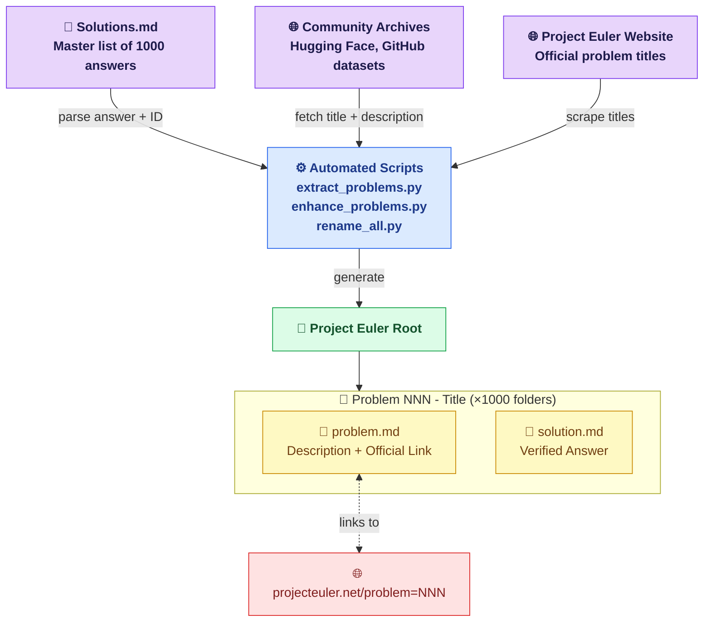

# 🧮 Project Euler — Solutions Archive

> A fully organized archive of solutions to [Project Euler](https://projecteuler.net) problems, with individual problem descriptions and verified numerical answers, spanning **1,000 problems** in total.

---

## 📌 What is Project Euler?

[Project Euler](https://projecteuler.net) is a series of challenging mathematical and computer programming problems. Each problem requires a unique combination of mathematical insight and programming skill to solve. Problems range in difficulty from **5%** (beginner) to **100%** (expert).

---

## 🗂️ Folder Structure

Every problem lives in its own self-contained folder:

```
Project Euler/
│
├── 📁 Problem 001 - Multiples of 3 and 5/
│   ├── 📄 problem.md        ← Full problem description + link
│   └── 📄 solution.md       ← Verified numerical answer
│
├── 📁 Problem 002 - Even Fibonacci numbers/
│   ├── 📄 problem.md
│   └── 📄 solution.md
│
├── 📁 Problem 003 - Largest prime factor/
│   ├── 📄 problem.md
│   └── 📄 solution.md
│
│   ... (994 named problems) ...
│
├── 📁 Problem 995/           ← Unnamed (not yet published)
│   ├── 📄 problem.md
│   └── 📄 solution.md
│
│   ... up to Problem 1000 ...
│
└── 📄 Solutions.md           ← Original master list of all 1000 answers
```

### Folder Naming Rules

| Format | Meaning |
|--------|---------|
| `Problem 001 - Multiples of 3 and 5` | Named problem — title sourced from official archive |
| `Problem 995` | Unnamed problem — not yet published on Project Euler |

---

## 🔗 Relationship Diagram

The diagram below illustrates how all components in this archive relate to each other:



---

## 📄 Inside Each File

### `problem.md` — Problem Description

```markdown
# Problem 001 - Multiples of 3 and 5

## Description

If we list all the natural numbers below 10 that are multiples of
3 or 5, we get 3, 5, 6 and 9. The sum of these multiples is 23.

Find the sum of all the multiples of 3 or 5 below 1000.

---

[Link to problem on Project Euler](https://projecteuler.net/problem=1)
```

### `solution.md` — Verified Answer

```markdown
# Problem 1 Solution

The solution to Project Euler Problem 1 is:

**233168**
```

---

## 📊 Archive Statistics

| Category | Count |
|----------|-------|
| ✅ Total problems with solutions | **1,000** |
| 📝 Problems with full descriptions | **918** |
| 🏷️ Problems with official titles | **994** |
| ❓ Unnamed / unpublished problems | **6** |
| 🆕 Latest named problem | **Problem 994 — Counting Triangles** |

---

## 🔍 Quick Reference

| Problem ID | Title | Category |
|------------|-------|----------|
| 001 | Multiples of 3 and 5 | Arithmetic |
| 002 | Even Fibonacci Numbers | Sequences |
| 003 | Largest Prime Factor | Number Theory |
| 004 | Largest Palindrome Product | Combinatorics |
| 005 | Smallest Multiple | Number Theory |
| 006 | Sum Square Difference | Arithmetic |
| 007 | 10001st Prime | Primes |
| 008 | Largest Product in a Series | Sequences |
| 009 | Special Pythagorean Triplet | Geometry |
| 010 | Summation of Primes | Primes |
| ... | *(see individual problem folders)* | ... |

---

## 🛠️ Tools Used

- **Python 3.12** — Scripts for parsing, generating, and renaming all 1000 folders.
- **Hugging Face Dataset** (`alexandonian/project-euler`) — Provided descriptions for Problems 1–918.
- **Community JSON Archive** (`jfblomgren/project-euler-data`) — Problem titles for Problems 1–330.
- **Browser Automation** — Scraped problem titles from the official Project Euler archives for problems 919–994.

---

> ⚠️ **Disclaimer**: The answers stored here are for personal study and reference only. Project Euler encourages solvers to first attempt each problem independently. Please respect the community guidelines at [projecteuler.net/about](https://projecteuler.net/about).
